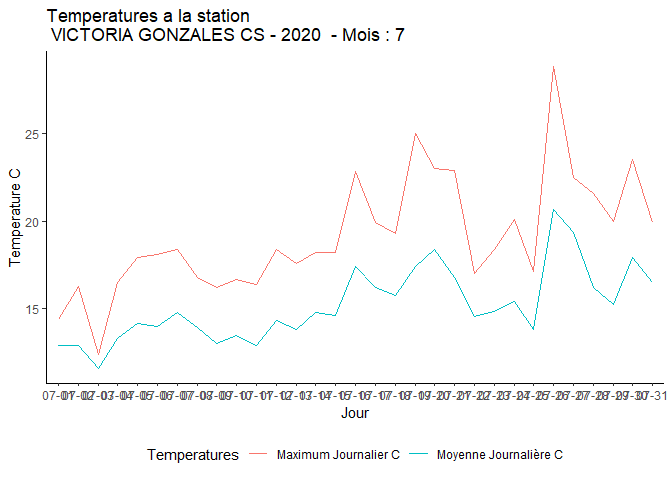

<!-- README.md is generated from README.Rmd. Please edit that file -->

# Rmeteocanada

<!-- badges: start -->

<!-- badges: end -->

The goal of Rmeteocanada is to download weather data from an
Environnement Canada station and provide graphs analyzing it

## Installation

You can install the the development version from
[GitHub](https://github.com/) with:

``` r
# install.packages("devtools")
devtools::install_github("A-Istrate/Rmeteocanada")
```

## Example

This is a basic example which shows you how to solve a common problem:

``` r
library(Rmeteocanada)
## basic example code
#Nous allons tester nos fonctions en une ligne qui devrait récupérer les données  pour la station 114 depuis le serveur et générer le graphique des temperatures pour le mois de juillet
graphique_meteo(donnees_meteo_station(114),7,"t")
#> Loading required package: dplyr
#> 
#> Attaching package: 'dplyr'
#> The following objects are masked from 'package:stats':
#> 
#>     filter, lag
#> The following objects are masked from 'package:base':
#> 
#>     intersect, setdiff, setequal, union
#> Loading required package: ggplot2
#> Loading required package: cowplot
#> Warning: package 'cowplot' was built under R version 4.0.3
```


